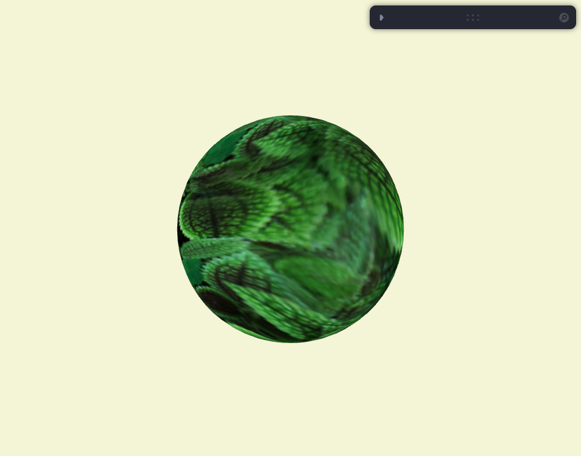

# react-three-starter

Example of a Three.js WebGL canvas invoked and destroyed within the React lifecycle

[View demo](https://loksland.github.io/react-three-starter/)

### Features

- Supports React strict mode
- Hot module reloading
- Typesafe
- Retina display support
- Demo includes custom shader material
